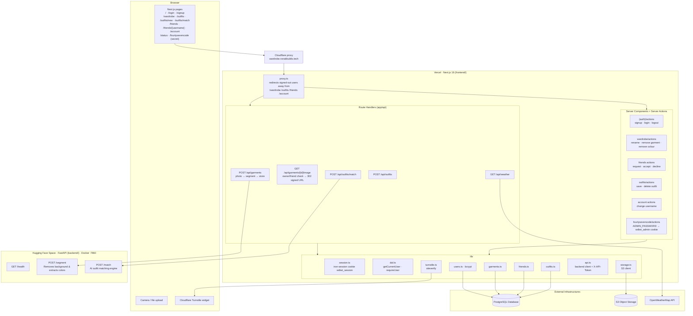
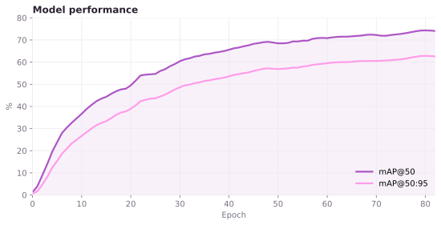
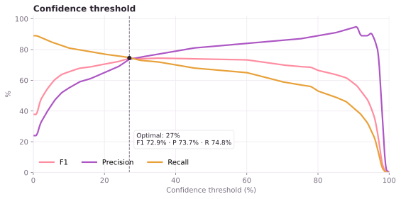
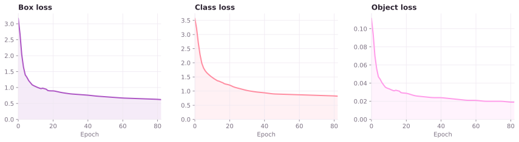

# What Do I Wear Today?
> Ever took hours to decide what to wear? So did I. Thats why this exists! Simply uploada a picture of your wardrobe (Mirror selfies, your clothes laid out over your bed, etc) and create a digital wardrobe which you can build outfits with AI based on the temperature and activity you got planned, or try building matching fits with your friends. [Try it out here!](https://wardrobe.ronakbuilds.tech/)

---

## Architecture

The project is split into `frontend/` and `backend/` directories splitting the deployment for both between **Vercel** (frontend) and **Huggingface Spaces via Docker** (backend).

The complete working is demonstrated in the flowchart below:




## API Reference

**Base URL:** `https://fourtysevencode-what-do-i-wear-today.hf.space`

| Method | Path            | Auth  | Description                                       |
| ------ | --------------- | ----- | ------------------------------------------------- |
| GET    | `/health`       | none  | Service status and uptime                         |
| POST   | `/segment`      | token | Cut garments out of a photo and detect colours    |
| GET    | `/weather`      | none  | Current weather and today's forecast (`?q=` or `?lat=&lon=`) |
| POST   | `/outfit`       | token | Pick one outfit from a wardrobe (Gemini)          |
| POST   | `/outfit/match` | token | Coordinated outfits for two people (Gemini)       |

"token" means the endpoint needs the `X-API-Token` header when the server has `API_TOKEN` set.

### `POST /segment`

Segments a photo of an outfit into separate garments using a YOLO ONNX model.
Each garment comes back as a transparent PNG with its label, how confident the model is, and its main colours.

**Headers:** `X-API-Token` (when enabled)

**Body:** `multipart/form-data`

| Field   | Type | Required | Description                    |
| ------- | ---- | -------- | ------------------------------ |
| `image` | file | yes      | The photo (JPEG, PNG, etc.)    |

**Example**

```bash
curl -X POST "$BASE_URL/segment" \
  -H "X-API-Token: $API_TOKEN" \
  -F "image=@mirror-selfie.jpg"
```

**Response `200`**

```json
{
  "count": 2,
  "items": [
    {
      "label": "shirt",
      "confidence": 0.912,
      "colors": [
        { "name": "navy", "hex": "#1f2a44", "percentage": 71.4 },
        { "name": "white", "hex": "#f2f2f0", "percentage": 22.0 }
      ],
      "image": "<base64-encoded PNG>"
    }
  ]
}
```

- `colors` holds up to 3 colours, largest share first. They're found with k-means clustering in Lab colour space and named against a fashion palette.
- `image` is a base64 PNG cut out to the garment's mask.

**Errors**

| Status | When                                       |
| ------ | ------------------------------------------ |
| 400    | The upload couldn't be decoded as an image |
| 401    | Missing or wrong API token                 |
| 422    | No `image` field in the form               |
| 500    | The segmentation pipeline failed           |

## Running locally

### Prerequisites

- Python 3.11
- Node.js 20+
- The model file at `models/weights.onnx` (it isn't in git)
- A [Neon](https://neon.tech) Postgres database, a private [Backblaze B2](https://www.backblaze.com/cloud-storage) bucket and a [Gemini API key](https://aistudio.google.com/apikey)

### Backend (FastAPI)

1. From the repo root, create a virtual environment and install the dependencies:

   ```bash
   python3.11 -m venv .venv
   source .venv/bin/activate
   pip install torch torchvision --index-url https://download.pytorch.org/whl/cpu
   pip install -r backend/requirements.txt
   ```

2. Create a `.env` file in the repo root:

   ```bash
   GEMINI_API_KEY=your-gemini-key
   # Optional: when set, the frontend must send the same value
   API_TOKEN=
   ```

3. Load `.env` and start the server. Run it from inside `backend/`, because `app.py` imports `services.*`:

   ```bash
   set -a && source .env && set +a
   cd backend
   uvicorn app:app --reload --port 8000
   ```

The API is now at `http://localhost:8000`. FastAPI's interactive docs are at `/docs`.

**Docker alternative:** build and run the same image the Space uses.

```bash
docker build -t what-do-i-wear-today-api .
docker run -p 7860:7860 --env-file .env what-do-i-wear-today-api
```

### Frontend (Next.js)

1. Install the dependencies:

   ```bash
   cd frontend
   npm install
   ```

2. Create `frontend/.env.local`:

   ```bash
   # Point at your local backend (defaults to the HF Space)
   API_URL=http://localhost:8000
   API_TOKEN=

   DATABASE_URL=postgres://...
   SESSION_PASSWORD=at-least-32-random-characters

   B2_KEY_ID=
   BLAZE_B2_APP_KEY=
   B2_BUCKET=
   B2_ENDPOINT=https://s3.<region>.backblazeb2.com

   ADMIN_PASSWORD=

   # Cloudflare Turnstile test keys (always pass)
   NEXT_PUBLIC_TURNSTILE_SITE_KEY=1x00000000000000000000AA
   TURNSTILE_SECRET_KEY=1x0000000000000000000000000000000AA
   ```

3. Create the tables and seed the test accounts (`test` / `test47` and `test2` / `test47`):

   ```bash
   npm run db:migrate
   npm run db:seed
   ```

4. Start the dev server:

   ```bash
   npm run dev
   ```

Open `http://localhost:3000`. The `/status` page checks whether the backend is reachable.


## Model

Garments are found by a **YOLO26s-seg** instance segmentation model (Ultralytics), exported to ONNX (`models/weights.onnx`, 640×640 input) and run on CPU with ONNX Runtime.
Each detected mask is cut out into a transparent PNG, then its colours are found with k-means clustering in Lab colour space.

It detects 13 clothing classes:

| | | | |
| --- | --- | --- | --- |
| long sleeve top | short sleeve top | long sleeve outwear | short sleeve outwear |
| long sleeve dress | short sleeve dress | sling dress | vest dress |
| trousers | shorts | skirt | vest |
| sling | | | |

### Results

Trained for 82 epochs.

| Metric | Value |
| --- | --- |
| mAP@50 | ~74% |
| mAP@50:95 | ~63% |
| F1 (at 27% confidence) | 72.9% |
| Precision | 73.7% |
| Recall | 74.8% |







<sub>Charts are redrawn from the Roboflow training report (`docs/model/charts.py`), so the curves are close traces, not exact values.</sub>

### Dataset

Trained on [**Clothes Detection**](https://universe.roboflow.com/project-w297p/clothes-detection-dpnaj) from Roboflow Universe, by `project-w297p`. Thanks to its authors for making it public.

---

This project was made with 💗 from fourtysevencode

Shipped to [Hack Club Terra](https://terra.hackclub.com) 2026