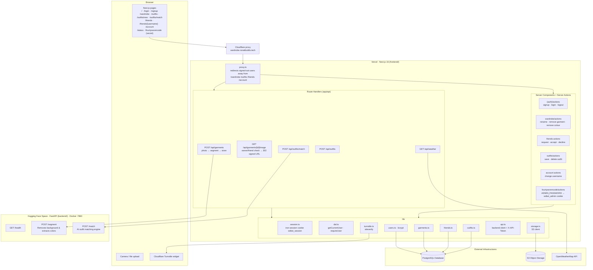

# What Do I Wear Today?
> Ever took hours to decide what to wear? So did I. Thats why this exists! Simply uploada a picture of your wardrobe (Mirror selfies, your clothes laid out over your bed, etc) and create a digital wardrobe which you can build outfits with AI based on the temperature and activity you got planned, or try building matching fits with your friends. [Try it out here!](https://wardrobe.ronakbuilds.tech/)

---

## Architecture

The project is split into a `frontend/` and `backend/` directories splitting the deployment for both between vercel (frontend) and huggingface spaces via docker (backend).

The complete working is demonstrated in the flowchart below:

